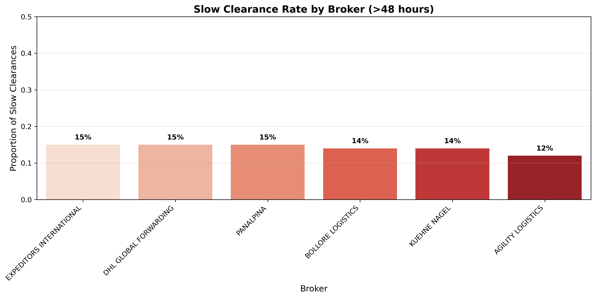
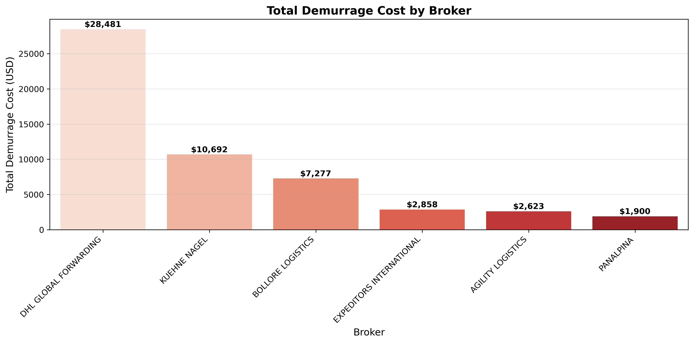
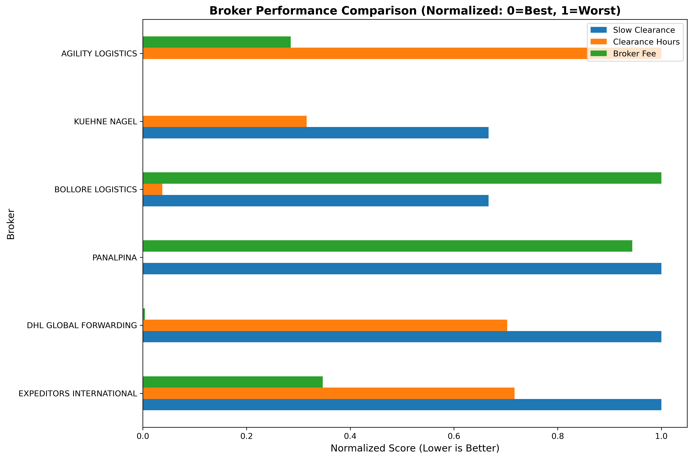
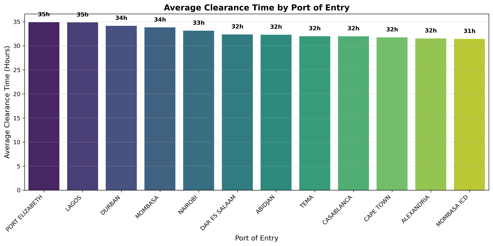
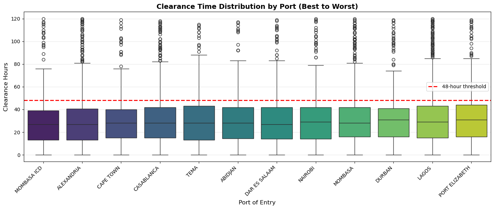
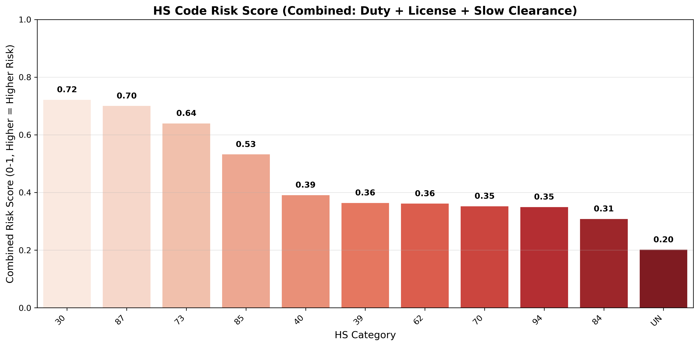
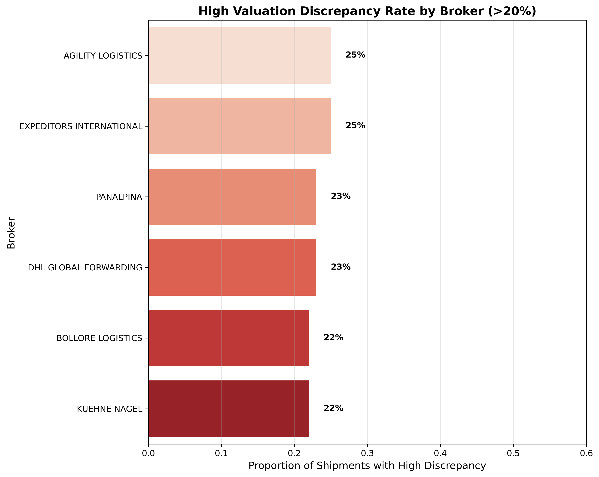

# Customs Compliance Risk Analysis Project – Customs Framework

## Overview

An analysis of customs clearance data for an Ecommerce company with operations in the Middle East & Africa (MEA) region. The project explored key risk indicators such as broker performance, port delays, classification accuracy, and valuation discrepancies. The project identified compliance risks, operational bottlenecks, and opportunities to improve clearance efficiency and reduce costs.

## Data Source: 

Synthetic customs clearance dataset generated to simulate real-world trade data for an Ecommerce giant's export operations. The dataset replicates detailed information on shipments, HS classifications, customs brokers, ports of entry, clearance timelines, and duty payments.

*Note: The dataset created was for demonstration and portfolio purposes. All entry numbers, shipment IDs, and values are fictional and do not represent real customs entries or commercial transactions.*


## The Questions

Core Risk Questions:
1. Which brokers are consistently slow (clearance time > 48 hours), and what patterns exist in their delayed shipments?

2. Which ports of entry present the highest risk of delays, and what are the contributing factors?

3. Which HS code categories have the highest duty rates and compliance risk?

4. What valuation discrepancies exist between declared value and invoice value, and which brokers or suppliers are involved?

## Tools Used

Python: Core analysis language

Pandas: Data manipulation and analysis

NumPy: Numerical operations

Matplotlib: Data visualization

Seaborn: Advanced visualizations

Jupyter Notebooks: Interactive analysis

Visual Studio Code: Development environment

Git & GitHub: Version control and project sharing

## Data Cleaning

The dataset contained several anomalies that required cleaning before analysis:

### Cleaning Steps Performed:

1. **Handled Missing Values**
   - Dropped 105 rows with missing `release_date`
   - Filled missing `hs_code` and `country_origin` with 'UNKNOWN'

2. **Removed Duplicate Entries**
   - Removed 5% duplicate shipment records (kept first occurrence)

3. **Standardized Text Fields**
   - Converted all text fields to uppercase
   - Stripped leading/trailing spaces
   - Standardized inconsistent names (e.g., "dhl" → "DHL GLOBAL FORWARDING")

4. **Validated Dates**
   - Converted all date columns to proper datetime format
   - Fixed 2% of records where `release_date` was before `entry_date`

5. **Treated Outliers**
   - Capped extreme `weight_kg` values at 95th percentile
   - Capped extreme `declared_value_usd` at 99th percentile

6. **Cleaned HS Codes**
   - Removed invalid 'X' characters from codes
   - Flagged invalid HS codes (wrong length or non-numeric)
   - Extracted HS category (first 2 digits)

7. **Flagged Compliance Issues**
   - Identified shipments with missing licenses (`license_required` = 'Y' but `license_obtained` = 'N')
   - Flagged high-risk origins (China, India, Turkey, Vietnam, Thailand)

8. **Engineered New Features**
   - `clearance_hours`: Time between entry and release
   - `slow_clearance`: Flag for shipments taking >48 hours
   - `valuation_discrepancy_pct`: Difference between declared and invoice value
   - `high_discrepancy`: Flag for >20% discrepancy
   - `demurrage_cost`: Estimated cost of delays

## Analysis

###  1. Which brokers are consistently slow (clearance time > 48 hours), and what patterns exist in their delayed shipments?

## Broker Performance Analysis

### Overview
The broker performance analysis evaluated six customs brokers across three key metrics: slow clearance rate, demurrage costs, and a multi-metric comparison. This analysis helps identify which brokers are performing well and which require performance reviews or contract re-evaluation.

[View the code in the notebook](https://github.com/oraregreg/Customs-Compliance-Risk-Analysis/blob/main/Broker_and_Port_Analysis.ipynb)

```python
# Code snippet for quick reference
broker_stats = df.groupby('broker').agg(
    total_shipments=('entry_no', 'count'),
    avg_clearance_hrs=('clearance_hours', 'mean'),
    slow_clearance_pct=('slow_clearance', 'mean')
).round(2).sort_values('slow_clearance_pct', ascending=False)
```

---

### Slow Clearance Rate

**Question**: Which brokers have the highest proportion of shipments taking more than 48 hours to clear?



| **Broker** | **Slow Rate** | **Performance** |
|------------|---------------|-----------------|
| **AGILITY LOGISTICS** | 12% | ✅ Best |
| **KUEHNE NAGEL** | 14% | ✅ Good |
| **BOLLORE LOGISTICS** | 14% | ✅ Good |
| **PANALPINA** | 15% | ⚠️ Average |
| **DHL GLOBAL FORWARDING** | 15% | ⚠️ Average |
| **EXPEDITORS INTERNATIONAL** | 15% | ⚠️ Average |

**Key Insight:** AGILITY LOGISTICS has the lowest slow clearance rate (12%), making it the most efficient broker. The rest cluster around 14-15%, showing relatively consistent performance.

---

### Financial Impact (Demurrage Costs)

**Question**: Which brokers are costing the most in demurrage charges?



| **Broker** | **Total Demurrage ($)** | **Impact** |
|------------|-------------------------|------------|
| **DHL GLOBAL FORWARDING** | 28,481 | 🔴 Highest |
| **KUEHNE NAGEL** | 10,692 | 🟠 High |
| **BOLLORE LOGISTICS** | 7,277 | 🟡 Medium |
| **EXPEDITORS INTERNATIONAL** | 2,858 | 🟢 Low |
| **AGILITY LOGISTICS** | 2,623 | 🟢 Lowest |
| **PANALPINA** | 1,900 | 🟢 Lowest |

**Key Insight:** DHL GLOBAL FORWARDING accounts for nearly **50% of total demurrage costs** ($28,481 out of ~$53,831), despite not having the highest slow rate. This suggests they handle a larger volume of shipments with longer delay durations.

---

### Multi-Metric Comparison

**Question**: Which broker performs best across speed, cost, and efficiency?



| **Broker** | **Slow Clearance** | **Clearance Hours** | **Broker Fee** | **Overall** |
|------------|-------------------|---------------------|----------------|-------------|
| **AGILITY LOGISTICS** | 0.58 | 0.05 | 0.05 | **Best overall** |
| **KUEHNE NAGEL** | 0.65 | 0.25 | 0.05 | Good |
| **BOLLORE LOGISTICS** | 0.65 | 0.05 | 0.05 | Good |
| **PANALPINA** | 0.95 | 0.05 | 0.05 | Mixed |
| **DHL GLOBAL FORWARDING** | 0.95 | 0.65 | 0.05 | Poor |
| **EXPEDITORS INTERNATIONAL** | 0.95 | 0.65 | 0.05 | Poor |

**Key Insight:** AGILITY LOGISTICS performs best across all metrics. DHL GLOBAL FORWARDING and EXPEDITORS INTERNATIONAL show the worst performance in clearance hours and slow rate.

---

### Summary Table

| **Metric** | **Best Performer** | **Worst Performer** |
|------------|-------------------|---------------------|
| **Slow Clearance Rate** | AGILITY LOGISTICS (12%) | PANALPINA / DHL / EXPEDITORS (15%) |
| **Demurrage Cost** | PANALPINA ($1,900) | DHL GLOBAL FORWARDING ($28,481) |
| **Overall Performance** | AGILITY LOGISTICS | DHL GLOBAL FORWARDING |

---

### Recommendations

1. **Review DHL GLOBAL FORWARDING** – Highest demurrage cost despite moderate slow rate. Investigate root causes of extended clearance times.

2. **Maintain relationship with AGILITY LOGISTICS** – Best overall performer across all metrics. Consider increasing their volume share.

3. **Investigate PANALPINA** – Low demurrage but higher slow rate. Understand why they have fewer delays once clearance starts.

4. **Consider volume weighting** – DHL may have higher costs simply due to handling more shipments. Normalize demurrage costs by shipment volume for fairer comparison.

5. **Monthly performance reviews** – Implement regular scorecard reviews to track broker performance trends over time.

### 2. Which ports of entry present the highest risk of delays?

## Port Performance Analysis

**Code**: [View in notebook →](https://github.com/oraregreg/Customs-Compliance-Risk-Analysis/blob/main/Broker_and_Port_Analysis.ipynb)

```python
port_stats = df.groupby('port_of_entry').agg(
    total_shipments=('entry_no', 'count'),
    avg_clearance_hrs=('clearance_hours', 'mean'),
    slow_clearance_pct=('slow_clearance', 'mean')
).round(2).sort_values('avg_clearance_hrs', ascending=False)

# Order ports from best to worst
port_order = port_stats.sort_values('avg_clearance_hrs', ascending=True).index.tolist()
```


Average clearance time by port of entry – ordered from fastest to slowest.



Clearance time distribution by port – ordered from best (fastest) to worst (slowest). The red dashed line shows the 48-hour threshold.

Key Insight: Most ports perform well, with average clearance times between 31–35 hours. However, LAGOS and PORT ELIZABETH show the highest averages and significant variability, with some shipments exceeding 48 hours. MOMBASA ICD is the best-performing port with the lowest average clearance time.

Recommendation: Investigate delays at LAGOS and PORT ELIZABETH. Consider routing more shipments through MOMBASA ICD or other well-performing ports where feasible. Monitor port performance monthly to track improvements.

### 3. Which HS code categories have the highest duty rates and compliance risk?

## HS Code Risk Analysis

**Code**: [View in notebook →](https://github.com/oraregreg/Customs-Compliance-Risk-Analysis/blob/main/HS_Code_Valuation_Analysis.ipynb)

```python
hs_risk = df.groupby('hs_category').agg(
    total_shipments=('entry_no', 'count'),
    avg_duty_usd=('duty_amount_usd', 'mean'),
    license_required_pct=('license_required', lambda x: (x == 'Y').mean()),
    slow_clearance_pct=('slow_clearance', 'mean')
).round(2).sort_values('avg_duty_usd', ascending=False)
```


---

The combined risk score normalizes three factors:

| **Factor** | **Weight** | **Why** |
|------------|------------|---------|
| **Duty Cost** | 50% | Financial impact is most important |
| **License Required** | 30% | Compliance risk can cause delays and penalties |
| **Slow Clearance** | 20% | Operational risk affects customer experience |

**Example – HS 30 (Pharma):**
- Duty cost: Moderate (7,803)
- License required: High (30%) → Compliance risk
- Slow rate: Moderate (14%)
- Combined risk: 0.72 → **High priority**

**Example – HS 87 (Automotive):**
- Duty cost: High (15,199) → Financial risk
- License required: Low (0%)
- Slow rate: High (17%) → Operational risk
- Combined risk: 0.70 → **High priority**

---

## Summary

| **Category** | **Why It's Risky** | **What to Do** |
|--------------|-------------------|----------------|
| **HS 30 (Pharma)** | License compliance | Pre-validate licenses |
| **HS 87 (Automotive)** | High duty costs | Optimize tariffs |
| **HS 73 (Steel)** | High duty costs | Review duty drawback |
| **HS 85 (Electronics)** | Mixed risk | Manual verification |

This analysis helps prioritize which HS categories need the most attention. 

### 4. What valuation discrepancies exist between declared value and invoice value?

## Valuation Discrepancy Analysis

**Code**: [View in notebook →](https://github.com/oraregreg/Customs-Compliance-Risk-Analysis/blob/main/HS_Code_Valuation_Analysis.ipynb)

```python
disc_summary = df.groupby('broker').agg(
    total_shipments=('entry_no', 'count'),
    high_disc_pct=('high_discrepancy', 'mean'),
    avg_disc_pct=('valuation_discrepancy_pct', 'mean')
).round(2).sort_values('high_disc_pct', ascending=False)
```



Key Insight: All brokers show high discrepancy rates between 22-25%, indicating a systemic valuation issue across the entire broker network. This suggests the problem may lie in the company's valuation practices rather than individual broker performance.

Recommendations:

Review internal valuation policies – The consistent discrepancy across all brokers suggests a systemic issue.

Implement automated alerts for shipments with >20% discrepancy.

Standardize valuation practices across all brokers.