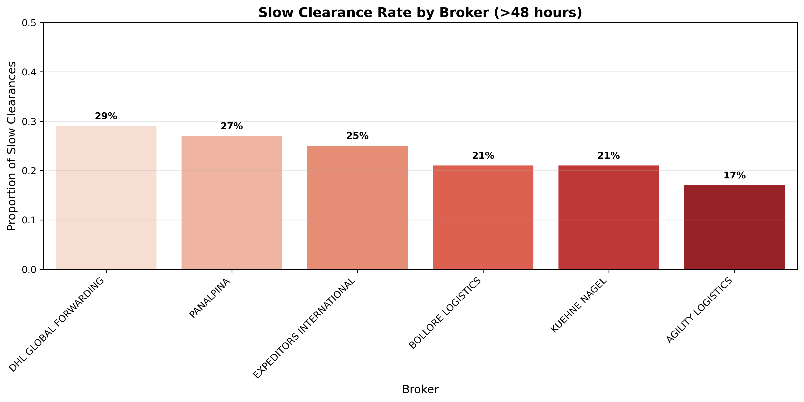
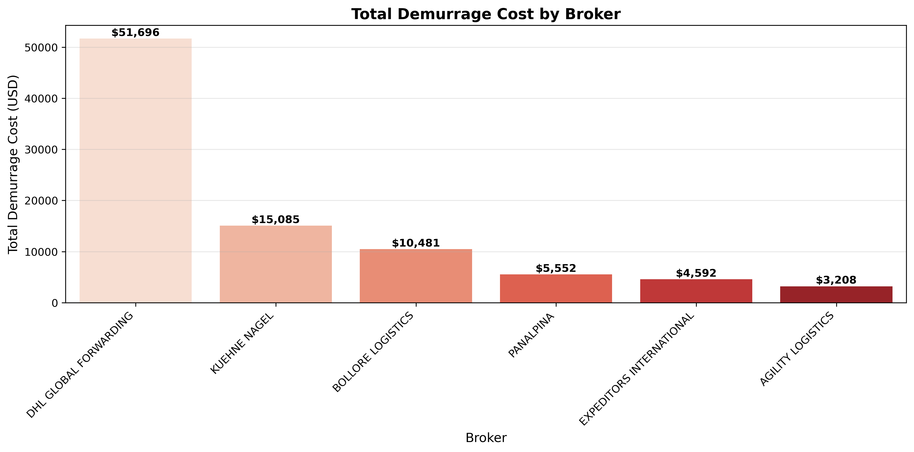
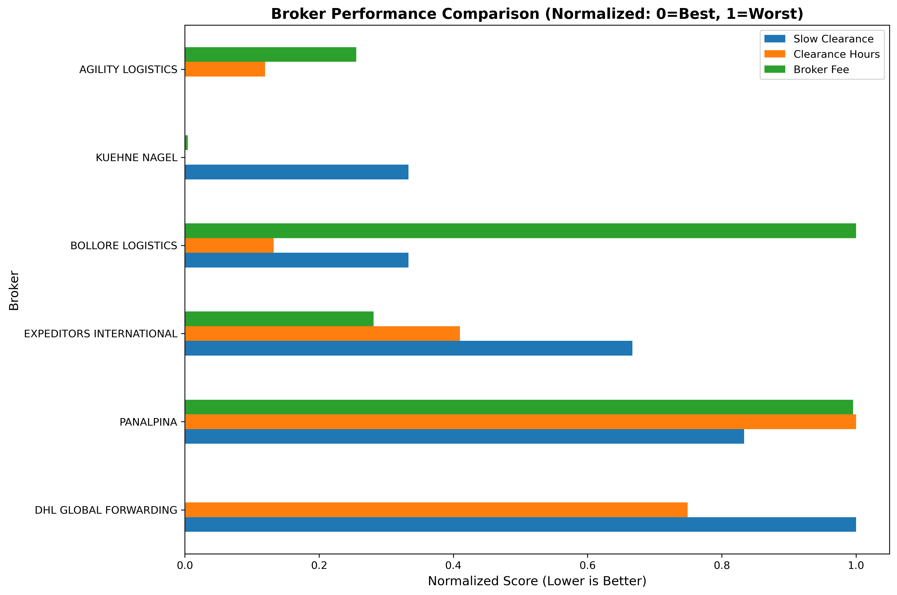
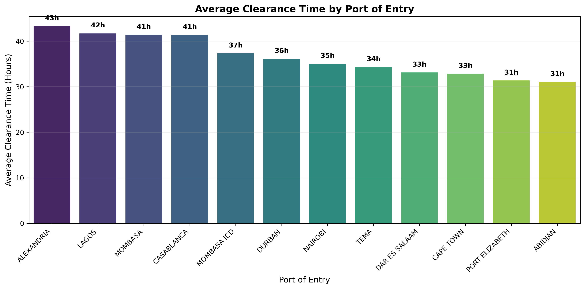
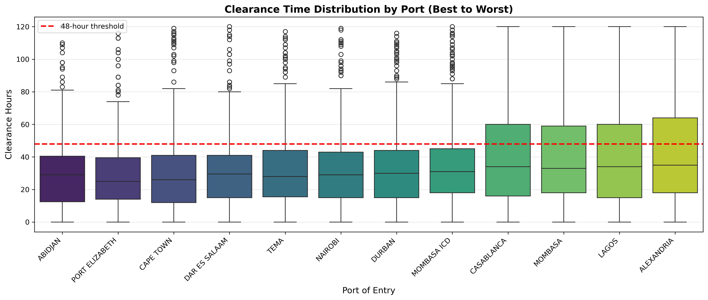
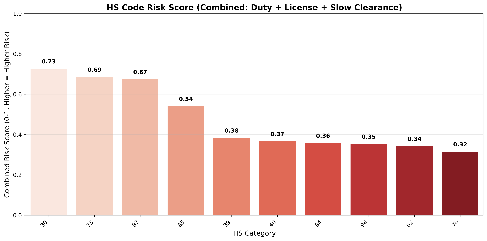
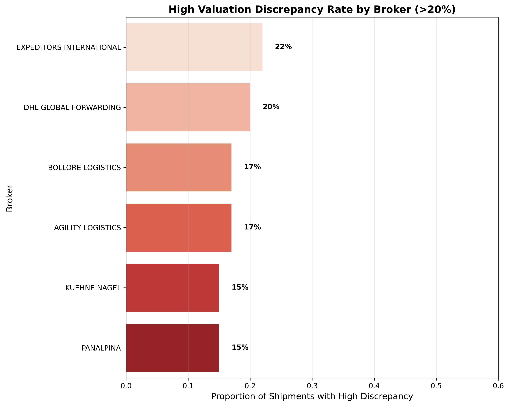

## Table of Contents

1. [Overview](#1-overview)
2. [Data Source](#2-data-source)
3. [The Questions](#3-the-questions)
4. [Tools Used](#4-tools-used)
5. [Data Cleaning](#5-data-cleaning)
   - 5.1 [Handled Missing Values](#51-handled-missing-values)
   - 5.2 [Removed Duplicate Entries](#52-removed-duplicate-entries)
   - 5.3 [Standardized Text Fields](#53-standardized-text-fields)
   - 5.4 [Validated Dates](#54-validated-dates)
   - 5.5 [Treated Outliers](#55-treated-outliers)
   - 5.6 [Cleaned HS Codes](#56-cleaned-hs-codes)
   - 5.7 [Flagged Compliance Issues](#57-flagged-compliance-issues)
   - 5.8 [Engineered New Features](#58-engineered-new-features)
6. [Analysis](#6-analysis)
   - 6.1 [Broker Performance Analysis](#61-broker-performance-analysis)
     - 6.1.1 [Slow Clearance Rate](#611-slow-clearance-rate)
     - 6.1.2 [Financial Impact (Demurrage Costs)](#612-financial-impact-demurrage-costs)
     - 6.1.3 [Multi-Metric Comparison](#613-multi-metric-comparison)
     - 6.1.4 [Summary Table](#614-summary-table)
     - 6.1.5 [Recommendations](#615-recommendations)
   - 6.2 [Port Performance Analysis](#62-port-performance-analysis)
   - 6.3 [HS Code Risk Analysis](#63-hs-code-risk-analysis)
   - 6.4 [Valuation Discrepancy Analysis](#64-valuation-discrepancy-analysis)
7. [From Descriptive to Predictive](#7-from-descriptive-to-predictive)


## 1. Overview

An analysis of customs clearance data for an Ecommerce company with operations in the Middle East & Africa (MEA) region. The project explored key risk indicators such as broker performance, port delays, classification accuracy, and valuation discrepancies. The project identified compliance risks, operational bottlenecks, and opportunities to improve clearance efficiency and reduce costs.

## 2. Data Source: 

Synthetic customs clearance dataset generated to simulate real-world trade data for an Ecommerce giant's export operations. The dataset replicates detailed information on shipments, HS classifications, customs brokers, ports of entry, clearance timelines, and duty payments. Risk outcomes (clearance delays, valuation discrepancies) are generated from realistic underlying drivers — broker performance tier, port congestion, high-risk country of origin, missing import licenses, weekend entries, and high-value shipments — rather than assigned at random, so the relationships explored below reflect genuine (simulated) cause-and-effect rather than sampling noise.

***Note: The dataset created was for demonstration and portfolio purposes. All entry numbers, shipment IDs, and values are fictional and do not represent real customs entries or commercial transactions.***


## 3. The Questions

Core Risk Questions:
1. Which brokers are consistently slow (clearance time > 48 hours), and what patterns exist in their delayed shipments?

2. Which ports of entry present the highest risk of delays, and what are the contributing factors?

3. Which HS code categories have the highest duty rates and compliance risk?

4. What valuation discrepancies exist between declared value and invoice value, and which brokers or suppliers are involved?

## 4. Tools Used

Python: Core analysis language

Pandas: Data manipulation and analysis

NumPy: Numerical operations

Matplotlib: Data visualization

Seaborn: Advanced visualizations

Jupyter Notebooks: Interactive analysis

Visual Studio Code: Development environment

Git & GitHub: Version control and project sharing

## 5. Data Cleaning

The dataset contained several anomalies that required cleaning before analysis:

### 5.1 Handled Missing Values
- Dropped 105 rows with missing `release_date`
- Filled missing `hs_code` and `country_origin` with 'UNKNOWN'

### 5.2 Removed Duplicate Entries
- Removed 5% duplicate shipment records (kept first occurrence)

### 5.3 Standardized Text Fields
- Converted all text fields to uppercase
- Stripped leading/trailing spaces
- Standardized inconsistent names (e.g., "dhl" → "DHL GLOBAL FORWARDING")

### 5.4 Validated Dates
- Converted all date columns to proper datetime format
- Fixed 2% of records where `release_date` was before `entry_date`

### 5.5 Treated Outliers
- Capped extreme `weight_kg` values at 95th percentile
- Capped extreme `declared_value_usd` at 99th percentile

### 5.6 Cleaned HS Codes
- Removed invalid 'X' characters from codes
- Flagged invalid HS codes (wrong length or non-numeric)
- Extracted HS category (first 2 digits)

### 5.7 Flagged Compliance Issues
- Identified shipments with missing licenses (`license_required` = 'Y' but `license_obtained` = 'N')
- Flagged high-risk origins (China, India, Turkey, Vietnam, Thailand)

### 5.8 Engineered New Features
- `clearance_hours`: Time between entry and release
- `slow_clearance`: Flag for shipments taking >48 hours
- `valuation_discrepancy_pct`: Difference between declared and invoice value
- `high_discrepancy`: Flag for >20% discrepancy
- `demurrage_cost`: Estimated cost of delays

## 6. Analysis

### 6.1 Broker Performance Analysis

**Question**: Which brokers are consistently slow (clearance time > 48 hours), and what patterns exist in their delayed shipments?

**Overview**: The broker performance analysis evaluated six customs brokers across three key metrics: slow clearance rate, demurrage costs, and a multi-metric comparison. This analysis helps identify which brokers are performing well and which require performance reviews or contract re-evaluation.

[View the code in the notebook](https://github.com/oraregreg/Customs-Compliance-Risk-Analysis/blob/main/Broker_and_Port_Analysis.ipynb)

```python
# Code snippet for quick reference
broker_stats = df.groupby('broker').agg(
    total_shipments=('entry_no', 'count'),
    avg_clearance_hrs=('clearance_hours', 'mean'),
    slow_clearance_pct=('slow_clearance', 'mean')
).round(2).sort_values('slow_clearance_pct', ascending=False)
```

---

### 6.1.1 Slow Clearance Rate

**Question**: Which brokers have the highest proportion of shipments taking more than 48 hours to clear?



| **Broker** | **Shipments** | **Slow Rate** | **Performance** |
|------------|---------------|---------------|-----------------|
| **AGILITY LOGISTICS** | 214 | 17% | ✅ Best |
| **KUEHNE NAGEL** | 986 | 21% | ✅ Good |
| **BOLLORE LOGISTICS** | 675 | 21% | ✅ Good |
| **EXPEDITORS INTERNATIONAL** | 236 | 25% | ⚠️ Average |
| **PANALPINA** | 230 | 27% | 🔴 Poor |
| **DHL GLOBAL FORWARDING** | 2,449 | 29% | 🔴 Worst |

**Key Insight:** AGILITY LOGISTICS has the lowest slow clearance rate (17%), making it the most efficient broker — consistent with a statistically significant relationship between broker and delay risk (χ² test, p < 0.001). DHL GLOBAL FORWARDING has both the highest volume and the highest slow rate, while PANALPINA — despite handling a much smaller volume — has the second-worst delay rate of any broker.

---

### 6.1.2 Financial Impact (Demurrage Costs)

**Question**: Which brokers are costing the most in demurrage charges?



| **Broker** | **Total Demurrage ($)** | **Avg per Shipment ($)** | **Impact** |
|------------|--------------------------|----------------------------|------------|
| **DHL GLOBAL FORWARDING** | 51,695.83 | 21.11 | 🔴 Highest |
| **KUEHNE NAGEL** | 15,085.42 | 15.30 | 🟠 High |
| **BOLLORE LOGISTICS** | 10,481.25 | 15.53 | 🟡 Medium |
| **PANALPINA** | 5,552.08 | 24.14 | 🟡 Medium |
| **EXPEDITORS INTERNATIONAL** | 4,591.67 | 19.46 | 🟢 Low |
| **AGILITY LOGISTICS** | 3,208.33 | 14.99 | 🟢 Lowest |

**Key Insight:** DHL GLOBAL FORWARDING accounts for roughly **57% of total demurrage costs** ($51,696 of ~$90,615 total), driven by a combination of the highest shipment volume *and* the highest delay rate. Notably, PANALPINA has the highest average demurrage cost *per shipment* ($24.14) despite modest total volume — its shipments that do run late tend to run later than most.

---

### 6.1.3 Multi-Metric Comparison

**Question**: Which broker performs best across speed, cost, and efficiency?



| **Broker** | **Slow Clearance** | **Clearance Hours** | **Broker Fee** | **Overall** |
|------------|-------------------|---------------------|----------------|-------------|
| **AGILITY LOGISTICS** | 0.00 | 0.12 | 0.26 | **Best overall** |
| **KUEHNE NAGEL** | 0.33 | 0.00 | 0.00 | Good |
| **BOLLORE LOGISTICS** | 0.33 | 0.13 | 1.00 | Mixed (cheap fee, expensive broker fee) |
| **EXPEDITORS INTERNATIONAL** | 0.67 | 0.41 | 0.28 | Mixed |
| **DHL GLOBAL FORWARDING** | 1.00 | 0.75 | 0.00 | Poor on speed, but cheapest fee |
| **PANALPINA** | 0.83 | 1.00 | 1.00 | **Worst overall** |

*(0 = best, 1 = worst on that metric, normalized across the six brokers)*

**Key Insight:** AGILITY LOGISTICS is the strongest all-round performer. PANALPINA is now the weakest across all three dimensions — slow, high broker fees, and the longest average clearance time — a meaningfully different conclusion than a broker that's merely "mixed."

---

### 6.1.4 Summary Table

| **Metric** | **Best Performer** | **Worst Performer** |
|------------|-------------------|---------------------|
| **Slow Clearance Rate** | AGILITY LOGISTICS (17%) | DHL GLOBAL FORWARDING (29%) |
| **Demurrage Cost (total)** | AGILITY LOGISTICS ($3,208) | DHL GLOBAL FORWARDING ($51,696) |
| **Overall Performance** | AGILITY LOGISTICS | PANALPINA |

---

### 6.1.5 Recommendations

1. **Review DHL GLOBAL FORWARDING** – Highest total demurrage cost *and* highest slow rate. Given the volume they carry, even a modest process improvement would meaningfully cut overall demurrage exposure.

2. **Maintain and consider expanding the relationship with AGILITY LOGISTICS** – Best overall performer across every metric measured.

3. **Escalate a performance review with PANALPINA** – Worst broker on the combined scorecard: elevated slow rate, highest broker fee, and the longest average clearance time, despite relatively low shipment volume.

4. **Consider volume weighting when comparing brokers** – DHL's high totals partly reflect handling roughly 5x the volume of the next-largest broker; per-shipment metrics (like average demurrage) tell a complementary story.

5. **Monthly performance reviews** – Implement regular scorecard reviews to track broker performance trends over time.


## 6.2 Port Performance Analysis

**Code**: [View in notebook →](https://github.com/oraregreg/Customs-Compliance-Risk-Analysis/blob/main/Broker_and_Port_Analysis.ipynb)

```python
port_stats = df.groupby('port_of_entry').agg(
    total_shipments=('entry_no', 'count'),
    avg_clearance_hrs=('clearance_hours', 'mean'),
    slow_clearance_pct=('slow_clearance', 'mean')
).round(2).sort_values('avg_clearance_hrs', ascending=False)

# Order ports from best to worst
port_order = port_stats.sort_values('avg_clearance_hrs', ascending=True).index.tolist()
```


Average clearance time by port of entry – ordered from fastest to slowest.



Clearance time distribution by port – ordered from best (fastest) to worst (slowest). The red dashed line shows the 48-hour threshold.

| **Port** | **Shipments** | **Avg Clearance (hrs)** | **Slow Rate** |
|---|---|---|---|
| ABIDJAN | 223 | 31.1 | 14% |
| PORT ELIZABETH | 243 | 31.4 | 16% |
| CAPE TOWN | 240 | 32.9 | 16% |
| DAR ES SALAAM | 236 | 33.1 | 19% |
| TEMA | 267 | 34.3 | 18% |
| NAIROBI | 204 | 35.1 | 19% |
| DURBAN | 269 | 36.1 | 20% |
| MOMBASA ICD | 246 | 37.3 | 18% |
| CASABLANCA | 734 | 41.4 | 30% |
| MOMBASA | 699 | 41.4 | 29% |
| LAGOS | 713 | 41.7 | 30% |
| ALEXANDRIA | 716 | 43.3 | 32% |

**Key Insight:** There is a clear, statistically significant split (χ² test, p < 0.001) between two tiers of ports. MOMBASA, CASABLANCA, LAGOS, and ALEXANDRIA — the four ports with historically known congestion issues — average 41–43 hours with 29–32% of shipments running slow. Every other port averages 31–37 hours with 14–20% running slow. ALEXANDRIA is the single worst-performing port; ABIDJAN is the best.

**Recommendation:** Prioritize operational review of MOMBASA, CASABLANCA, LAGOS, and ALEXANDRIA — the gap between these four ports and the rest of the network is large and consistent, not marginal. Where shipment routing is flexible, consider shifting volume toward ABIDJAN, PORT ELIZABETH, or CAPE TOWN. Monitor port performance monthly to track whether the gap narrows.


## 6.3 HS Code Risk Analysis

**Code**: [View in notebook →](https://github.com/oraregreg/Customs-Compliance-Risk-Analysis/blob/main/HS_Code_Valuation_Analysis.ipynb)

```python
hs_risk = df.groupby('hs_category').agg(
    total_shipments=('entry_no', 'count'),
    avg_duty_usd=('duty_amount_usd', 'mean'),
    license_required_pct=('license_required', lambda x: (x == 'Y').mean()),
    slow_clearance_pct=('slow_clearance', 'mean')
).round(2).sort_values('avg_duty_usd', ascending=False)
```


| **HS Category** | **Shipments** | **Avg Duty ($)** | **License Req. %** | **Slow Rate** | **Combined Risk Score** |
|---|---|---|---|---|---|
| 73 – Steel/Metal | 454 | 15,647 | 0% | 26% | 0.65 |
| 87 – Automotive | 453 | 15,065 | 0% | 27% | 0.65 |
| 30 – Pharmaceuticals | 447 | 7,533 | 28% | 26% | 0.55 |
| 85 – Electronics | 425 | 7,511 | 10% | 27% | 0.38 |
| 39 – Plastics | 485 | 5,752 | 0% | 28% | 0.22 |
| 40 – Rubber/Tyres | 456 | 5,428 | 0% | 27% | 0.18 |
| 84 – Machinery | 457 | 5,613 | 0% | 25% | 0.13 |
| 94 – Furniture | 463 | 5,480 | 0% | 25% | 0.13 |
| 62 – Textiles | 435 | 5,584 | 0% | 23% | 0.08 |
| 70 – Glass | 474 | 5,410 | 0% | 20% | 0.00 |

The combined risk score normalizes and weights three factors (Duty Cost 50%, License Required 30%, Slow Clearance 20%) across the 10 HS categories.

**Example – HS 30 (Pharma):** Moderate duty, but the *only* category with meaningful license risk (28% of shipments require one) → combined risk 0.55, driven primarily by compliance exposure rather than cost.

**Example – HS 73 (Steel) / HS 87 (Automotive):** No license requirement, but by far the highest duty burden of any category → combined risk 0.65 each, driven primarily by financial exposure.

**Summary**

| **Category** | **Why It's Risky** | **What to Do** |
|--------------|-------------------|----------------|
| **HS 73 (Steel)** | Highest duty cost | Review duty drawback / classification accuracy |
| **HS 87 (Automotive)** | Near-highest duty cost | Optimize tariff engineering |
| **HS 30 (Pharma)** | License compliance (28% of shipments) | Pre-validate licenses before shipment |
| **HS 85 (Electronics)** | Mixed: moderate duty + license risk | Manual verification |

This analysis helps prioritize which HS categories need the most attention.


## 6.4 Valuation Discrepancy Analysis

**Code**: [View in notebook →](https://github.com/oraregreg/Customs-Compliance-Risk-Analysis/blob/main/HS_Code_Valuation_Analysis.ipynb)

```python
disc_summary = df.groupby('broker').agg(
    total_shipments=('entry_no', 'count'),
    high_disc_pct=('high_discrepancy', 'mean'),
    avg_disc_pct=('valuation_discrepancy_pct', 'mean')
).round(2).sort_values('high_disc_pct', ascending=False)
```



| **Broker** | **Shipments** | **High-Discrepancy Rate** | **Avg Discrepancy %** |
|---|---|---|---|
| EXPEDITORS INTERNATIONAL | 236 | 22% | 10.5% |
| DHL GLOBAL FORWARDING | 2,449 | 20% | 8.9% |
| BOLLORE LOGISTICS | 675 | 17% | 8.0% |
| AGILITY LOGISTICS | 214 | 17% | 9.3% |
| KUEHNE NAGEL | 986 | 15% | 7.3% |
| PANALPINA | 230 | 15% | 6.8% |

**Key Insight:** Unlike broker slow rates, valuation discrepancy rates vary less dramatically by broker — but the difference is real and statistically significant (χ² test, p ≈ 0.003), not the flat, uniform pattern seen previously. EXPEDITORS INTERNATIONAL and DHL GLOBAL FORWARDING show meaningfully elevated discrepancy risk; PANALPINA and KUEHNE NAGEL are comparatively lower-risk. HS category also matters: Electronics, Automotive, and Steel shipments (categories 85/87/73) carry materially higher discrepancy risk than other product categories, consistent with these being common targets for duty-avoidance under-declaration in real customs environments.

**Recommendations:**

- **Prioritize broker-level review for EXPEDITORS INTERNATIONAL and DHL GLOBAL FORWARDING** – their discrepancy rates are the highest and not attributable to chance.
- **Apply extra scrutiny to Electronics, Automotive, and Steel shipments (HS 85/87/73)** regardless of broker, given their consistently elevated discrepancy risk.
- **Implement automated alerts for shipments with >20% discrepancy**, especially where both a higher-risk broker and higher-risk HS category coincide.


## 7. From Descriptive to Predictive

This project originally answered *what happened* — which brokers, ports, and product categories carried the most risk historically. The next phase of this project builds on the same dataset to answer *what's likely to happen* — a predictive risk-scoring model that flags high-risk shipments (delay risk and valuation risk) before they clear customs, using the broker, port, origin, and license-status relationships surfaced in Sections 6.1–6.4 above as engineered features. See `PREDICTIVE_MODELING.md` (or the predictive notebook, once added) for that work.

<!-- cache bust -->
<!-- cache bust 2026-09-13T00:20:34.6731081+03:00 -->
